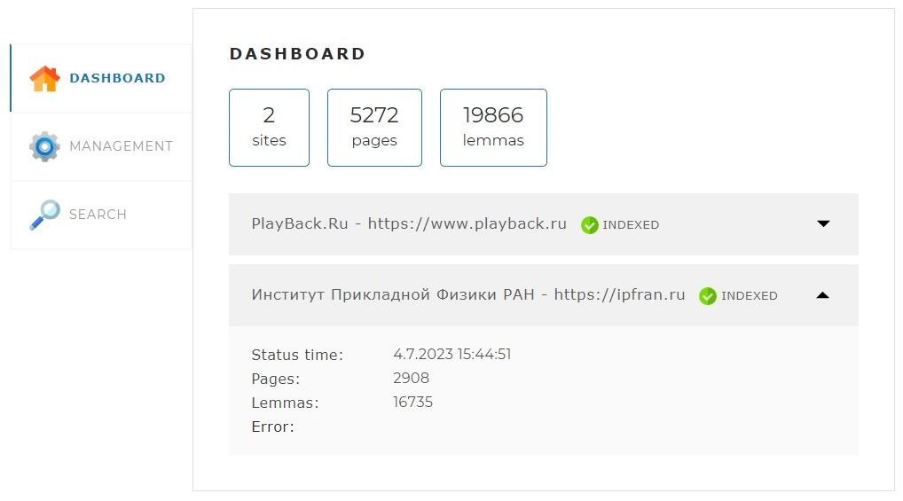

# Поисковый движок _**HeliontSearchBot_2.0**_

## Описание
Поисковый движок _**HeliontSearchBot_2.0**_ представляет собой Spring Boot приложение позволяющее индексировать страницы сайтов указанных в конфигурацирнном файле проекта (application.yaml) и осуществлять по ним быстрый поиск.

## Как осуществляется поиск
После запуска проекта, по адресу http://localhost:8080/ становится доступна фронтенд составляющая проекта (веб-интерфейс). Он представляет из себя одну веб-страницу с тремя вкладками:

### Dashboard.
Это стартовая вкладка (открывается по умолчанию). Она содержит общую информацию по всем сайтам из списка в конфигурационном файле.


Также детальную статистику и статус по каждому из сайтов.



### Management.
На этой вкладке находятся инструменты управления поисковым движком — запуск и остановка полной индексации (переиндексации). 


Также возможность добавить (обновить) отдельную страницу по ссылке.


### Search.
Эта страница предназначена для тестирования поискового движка. На ней находится поле поиска, выпадающий список с выбором сайта для поиска, а при нажатии на кнопку «Найти» выводятся результаты поиска.


## Используемые технологии
- Spring
- JSOUP
- Russian Morphology for Apache Lucene 
- Maven


## Системные требования:
- Java 17 или выше
- Maven 3.8 или выше
- MySql 8 или выше

## Запуск проекта:
Перед запуском проекта убедитесь, что Maven установлен правильно командой mvn -v, добавьте путь к каталогу bin в переменную окружения path.
Настройте Application.yaml, указав путь к базе данных и логин с паролем.

#### application.yaml:
```yaml
spring:
  datasource:
    username: YOUR_LOGIN
    password: YOUR_PASSWORD
    url: jdbc:mysql://localhost:3306/search_engine?useSSL=false&requireSSL=false&allowPublicKeyRetrieval=true
```

#### ШАГ 1. 

Клонировать проект: `git clone https://github.com/ykotlerov/HeliontSearchBot.git`

#### ШАГ 2.

Соберите проект с помощью Maven. Выполните команду в папке с проектом: `mvn -U clean package`

#### ШАГ 3.

Запустите проект командой: `java -jar HeliontSearchBot-2.0.jar` (application.yaml должен быть в этой же папке)


